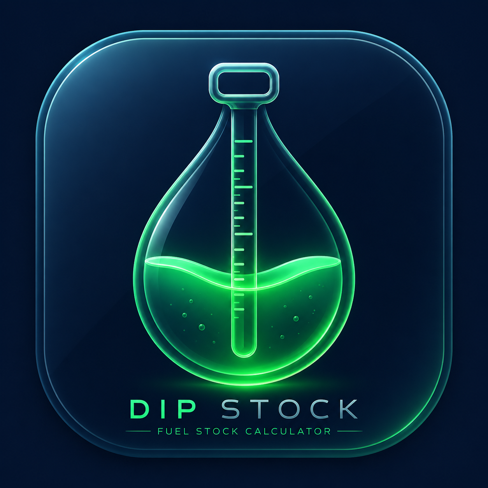

# ⛽ Dip Stock Converter

<div align="center">
  
  <p><em>A modern, offline-first mobile and web application for petrol pump owners and staff to accurately calculate fuel tank stock from manual dip stick readings.</em></p>
</div>

---

## 🌟 Overview

The **Dip Stock Converter** is a powerful utility designed specifically for fuel station management. Calculating the exact volume of fuel (MS/Petrol or HSD/Diesel) remaining in underground storage tanks can be a tedious process involving manual chart lookups and interpolation formulas. 

This application automates that entire process. By simply inputting a manual dip reading, the app instantly calculates the actual stock volume using embedded calibration charts and advanced difference calculations. 

Built with a stunning **Glassmorphism** UI, it works seamlessly as both a web application and a native Android app.

---

## 🚀 Key Features

*   **⚡ Real-Time Calculations:** Instantly converts dip stick readings (e.g., 164.4) into exact fluid volumes.
*   **📊 Integrated Reference Charts:** Built-in dip chart data allows for instant lookup of base volumes and difference values without flipping through paper manuals.
*   **☁️ Cloud Sync (Firebase):** All calculation logs are securely saved to Google Cloud Firestore. Never lose a reading, even if you clear your cache or change devices!
*   **📵 Offline Mode Persistence:** No signal at the pump? No problem! The app fully supports offline data entry. Logs are saved locally to your device and automatically synced to the cloud the moment you regain internet access.
*   **📄 Professional PDF Receipts:** Generate and download single-log PDF receipts detailing the calculation breakdown (Dip, Point Value, Diff Value, Actual Stock).
*   **📈 Bulk Data Export:** Export all historical logs into a beautifully formatted PDF report or an `.xlsx` Excel spreadsheet for accounting and auditing purposes.
*   **📱 Mobile-First Android App:** Converted into a high-performance native Android application using Capacitor, allowing for direct installation on any Android smartphone.
*   **🌗 Dynamic Theming:** Full support for sleek Dark Mode and clean Light Mode aesthetics.

---

## 🛠️ Technology Stack

*   **Frontend UI:** Vanilla JavaScript, HTML5, CSS3 (No heavy frameworks!)
*   **Design Trend:** Glassmorphism & Modern Material UI
*   **Backend & Database:** Google Firebase (Cloud Firestore)
*   **Mobile Wrapper:** Ionic Capacitor (`@capacitor/core`, `@capacitor/android`)
*   **Build Tool:** Vite.js
*   **Export Libraries:** `jsPDF`, `jsPDF-AutoTable`, `SheetJS (XLSX)`

---

## 📥 Installation & Setup

### Prerequisites
Make sure you have [Node.js](https://nodejs.org/) installed on your machine.

### 1. Clone the Repository
```bash
git clone https://github.com/Suraj278312/Dip-stock-converter.git
cd Dip-stock-converter
```

### 2. Install Dependencies
```bash
npm install
```

### 3. Run the Web App Locally
```bash
npm run dev
```
Navigate to `http://localhost:5173/` in your browser.

---

## 📱 Building the Android App

This project uses Capacitor to compile the web code into a native Android app. 

1. **Build the Web Assets:**
   ```bash
   npm run build
   ```
2. **Sync with Android Project:**
   ```bash
   npx cap sync
   ```
3. **Open Android Studio:**
   ```bash
   npx cap open android
   ```
4. From Android Studio, you can run the app on an emulator or click **Build > Build Bundle(s) / APK(s) > Build APK(s)** to generate a file you can install on your phone.

---

## 🗄️ Database Structure

The app utilizes Firebase Cloud Firestore with a simple `dip_stock_logs` collection. Each document represents a single calculation log with the following structure:

```json
{
  "actual_total_stock": 21546,
  "created_at": "timestamp",
  "date": "2026-05-13",
  "diffValue": "12.54",
  "difference": 4.18,
  "dip": "205.6",
  "pointHalf": 1.5,
  "pointValue": 3,
  "product": "MS",
  "volume": 21495.32
}
```

---

## 👨‍💻 Author

**Made By Suraj Debnath**  
Passionate about creating modern software solutions for everyday business challenges.

---

<div align="center">
  <i>If you find this project helpful, please consider giving it a ⭐ on GitHub!</i>
</div>
